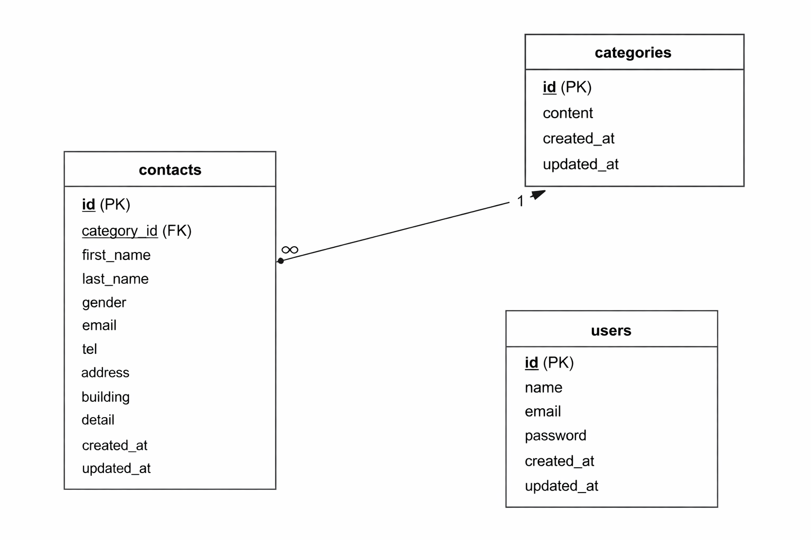

# アプリケーション
Contact Form（お問い合わせフォーム）

## 環境構築

### 1. Docker ビルド
・git clone git@github.com:tsumika0524/contact-form.git 
・docker-compose build

### Laravel環境構築
docker-compose up -d
docker exec -it contact-form bash
cp .env.example .env
php artisan key:generate
composer install
npm install
npm run dev
php artisan migrate
php artisan db:seed

#### 環境開発URL
・お問い合わせフォーム入力ページ：http://localhost
・お問い合わせフォーム確認ページ：http://localhost//contacts/confirm
・サンクスページhttp://localhost/thanks
・管理画面: http://localhost/admin
・ユーザ登録：http://localhost/register
・ログイン：http://localhost/login

##### 使用技術(実行環境)
・PHP 8.4.13
・Laravel 8.83.29
・MySQL 8.0.26 
・nginx 1.21.1 
・jquery 3.7.1.min.js

######　ER図

